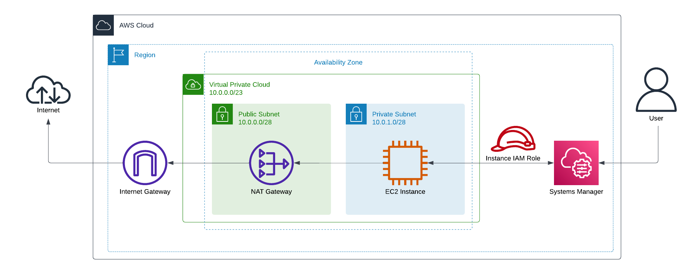

# workstation
This project contains the Infrastructure as Code (IaC) and  Environment as Code (EaC) for an AWS EC2 based workstation.

## Architecture
For the networking a VPC is created with a public and private subnet. The EC2 instance is created in the private subnet 
and can access the internet via a NAT gateway in the public subnet via an internet gateway. The instance has a role 
attached which enables it to be manged using systems manager. This makes it possible for the user to open an SSH tunnel 
to securely connect directly to the instance.

## Connecting
1. Ensure that you have the session manager plugin for the AWS cli installed: https://docs.aws.amazon.com/systems-manager/latest/userguide/session-manager-working-with-install-plugin.html
2. Start a session (use your instance id as the target value):

       aws ssm start-session \
           --target i-123456789 \
           --document-name AWS-StartPortForwardingSession \
           --parameters '{"portNumber":["3389"], "localPortNumber":["56789"]}'
3. Connect using a remote desktop client to `localhost:56789`